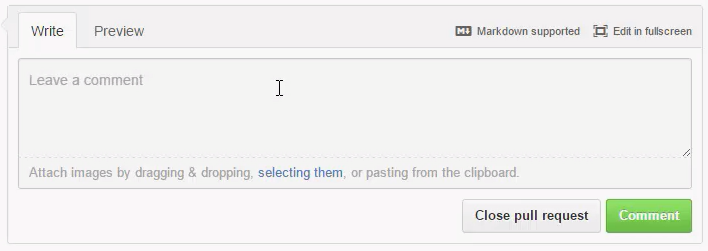

# Git Tutorial
## Markdown for Github
[Basic writing and formatting syntax](https://help.github.com/en/articles/basic-writing-and-formatting-syntax)

[Mastering Markdown](https://guides.github.com/features/mastering-markdown/)

[GitHub Flavored Markdown Spec](https://github.github.com/gfm/)

## Table of Contents
- [1 Fundamentals of Git](#1-fundamentals-of-git)
  - What is Git
  - Git Internals
- [2 Get Started on Git](#2-get-started-on-git)
  - Install Git
  - Configuring Git
  - Initializing Repository
- [3 Local Repositary](#staging-area)
  - Staging Area
  - Status Command
  - Commits
  - ignoring files
  - History of Commits
  - tags
  - stashing
  - rebase
- [Branches]()
  - Git Branches
  - fetch / pull
  - diff
  - merge
- [Remote Repositary, Github]()
  - SSH
  - remote
  - Push
- [Teamwork on Github]()
  - Fork
  - Creating a pull request
  - Handling a pull request
- [Other Services on Github]()
  - GitHub Pages
  - Gist

## 1 Fundamentals of Git
### 1.1 What is Git
Git is a distributed **SCM (Source Control Management)** system.

- Free and open source
- Back-up of the files
- Roll-back to a specific point
- Team development (Every developor has a full copy of the project and works in parallel.)
- Fast speed and automated efficiency
- **Github**, a popular git remote repository

### 1.2 Git Internals (Git Objects)
The core of Git is a simple **key-value** data store.

#### cat-file
Provide content or type and size information for repository objects:<br />
**git cat-file**

Pretty-print the contents of object based on its type:<br />
`$ git cat-file -p xxxxxxx`

#### 1.2.1 Key
For accessing Git Objects, all objects have a unique, 40-character, SHA-1 hash.
- The first 2 characters: the name of the directory
- The remaining 38 characters: the name of the file 

The shortened version of the hash has 7-character.

### 1.2.2 Type of Value
3 types of Git Objects:
1. Blob
    - Git stores **zlib compressed files** (file contents) as blobs.
2. Tree
    - Git stores **directories** (folders) as trees in the file system. Git maintains 3 kinds of trees:
      1. Working directory, which contains
          - .git folder == repository, where Git stores its objects.
          - actual project files (.c, .cpp, .etc), which are original uncompressed files.
      2. Staging area(index)
      3. HEAD, which points to the most recent commit
3. Commit
    - Commit objects are **snapshots of the repository** at a given point in time.

### 1.2.3 Data of Value
- Blob & Tree. Each item in a tree contains 4 pieces of data:
  1. Permissions for the object
  2. Type of object: tree or blob
  3. Hash of the object
  4. Filename
- Commit Objest. A commit contains 4 pieces of data:
  1. Who made the commit
  2. The commit message
  3. The hash of the parent commit. All commits, except the first, have at least one parent (parent commit).
      - Commit only stores the change of the commit.
      - If the contents of a file haven't changed, Git can just point to the content in a previous commit using its hash. 
      There is no copy of the same file.
  4. The hash of the tree that contains the content of the commit.

# 2 Get Started on Git
## 2.1 Installing Git
- Download
  - [`https://git-scm.com/`](https://git-scm.com/)
  - [`https://git-scm.com/downloads`](https://git-scm.com/downloads)

- Echo the version of Git installed
  - `$ git --version`

## 2.2 Configuring Git
- 3 different levels of config
  1. system level
  2. global level
  3. local level

- Edit **global config**
  - Via `$ git config --global ...`
    - Edit user name: `$ git config --global user.name "username"`
    - Edit user email: `$ git config --global user.email "username@email.com"`
  - Via `git config --global --edit`
    - The actual file of global config on Win32: `C:\Users\username\.gitconfig`

- [Edit **local config**](#config-file-local-config)

- Generate **git-config Manual Page** and open it in the default web browser
  - `$ git config --help`<br />
  - The file actually generated on Win32 x64: `file://.../Git/mingw64/share/doc/git-doc/git-config.html`

## 2.3 Initializing Repository
- Initialize an empty Repository (folder `.git`) in Working Directory
    - `cd` to Working Directory and then `$ git init`
    - Working Directory can be created in advance by `mkdir`

- Make Working Directory and initialize Repository
    - `$ git init "repository-name"`
    - Quite Mode without any message back: `$ git init -q "repository-name"`

### `description` file (name of the repository)
- Edit the content of this file to name the repository

### `config` file (local config)
- For example, adding username to **local config**
  - Via command `$ git config --local user.name "username"`
  - Via directly editting this file, adding
    ```
    [user]
        name = username
    ```

# 3 Core of Git
## 3.1 Tracking files
### 3.1.1 Staging Area
Stating Area == pre-commit area:<br />
- Intermediary step between untracked and tracked files.
- Or between un-added and added content that has changed.

### 3.1.2 Status
We use `git status` command to see the state of the repository:<br />
- the changes are unstaged for commit
- the changes are staged and ready to be commited

### 3.1.3 Staging (tracking)
We use `git add` to track these untracked files.

- For example, to track everything that has changed:<br />
`$ git add .` 

### 3.1.4 Commit
Commit is to make changes which we have staged to the repository permanent. We use `git commit` command to make a commit. After that, everything we stage is committed.

Options of `git commit`:
- `-m`
  - This is a mandatory option.
  - For example, to give the message associated with the commit:<br />
  `$ git commit -m "Added the readme.md file"`

- `-am`
  - For example, to add everything and commit:<br />
  `$ git commit -am "Added the readme.md file"`

- `--amend`
  - This option is to amend a previous commit.
  - For example, to add everything changed to the stage area and amend the previous commit:<br />
  `$ git commit -a --amend`

**Delete** commits of current local branch:

Undoing the Last Commit

`$ git reset --soft HEAD~1`

`$ git reset --hard HEAD~1`

#### Undoing Multiple Commits
The same technique allows you to return to any previous revision:

`$ git reset --hard 0ad5a7a6`

### 3.1.5 Log of Commit
In order to show the history of the project as a series of commits, 
we use `git log` to view a history of the commits in the project:
1. Which files were changed.
2. When files were changed.
3. Who changed files.

The log command is very customizable and can give us a lot of different output.
Numberous flags to control how the information is displayed:
- To view the log in **defualt** format, the most recent commit is showing first:<br />
`$ git log`

- To view the **condensed** log **one line** per commit, use oneline mode:<br />
`$ git log --oneline`

- **not too much** info mode (a small versio of how they changed):<br />
`$ git log --stat`

- **verbose** mode including the output of diff (patch?):<br />
`$ git log -p`

- Use `--pretty` to specify exactly how much info we want to show, creating a custom display:
  - identical to oneline mode<br />
    `$ git log --pretty=oneline`
  - a bit more info<br />
    `$ git log --pretty=short`
  - a bit more agian(with author and commit)<br />
    `$ git log --pretty=full`
  - **maximum**<br />
    `$ git log --pretty=fuller`
  - our own format of "pretty".<br />
    $ git log --pretty=format:"string"
    - For example, shortened commit hash | name of the author(author email) : commit message<br />
        `$ git log --pretty=format:"%h | %an(%ae) : %s"`
    - On the top of the above example, do some colors with `%C`<br />
        `$ git log --pretty=format:"%h | %an(%Cblue%ae%Creset) : %s"`
    - Use **--help** to see what the placeholders are:<br />
        `$ git log --help`<br />


- latest commit mode<br />
```
$ git log -1
$ git log -2
...
```
- latest commit mode combined with --oneline<br />
    `$ git log -1 --oneline`

- **color labeled** info<br />
    `$ git log --decorate`

- differet branches, different commits<br />
    `$ git log --graph`

- For more options, open the help file in the default browser:<br />
    `$ git log --help`

## 3.2 Ignoring files
To ignore particular **files** or **folders** to stop Git tracking them:
- Locally, use a `.gitignore` file to specify files or folders to ignore locally.
- Globally, define a excludesfile `gitignore_global.txt` in global config to ingnore files or folders globally.

### 3.2.1 Ignoring files on Local Level
- Conventionally, the ignore file on the local level is `.gitignore`.
- To ignore **files**:
```
    # untracked files
    file_name
    Thumbs.db
    *.dll
```
- To ignore the **folder** and the **files in the folder**:
```
    # untracked folders
    folder_name
```
- The comments in the ignore file begin with `#`.
### 3.2.2 Ignoring files on System Level
Use `git config --global --edit` to define a global ignore file:
```
    [core]
	    excludesfile = gitignore_global.txt
```

## 3.3 Git Branches
Branches are a fundamental feature in Git.

We start out with a master branch automatically when we initialize a repository.
- Specifying **-a** to show all the branches:<br />
    `$ git branch -a`
- **Create** a **new** branch:<br />
    `$ git branch branch-name`
- Create a new branch and switch to it immediately:<br />
    `$ git checkout -b branch-name`
- **Switch** to branch:<br />
    `$git checkout branch-name`
- Delete a branch
    1. Switch back to master branch<br />
        `$ git checkout master`
    2. Delete the branch<br />
        `$ git branch -d branch-name`<br />
        Force to delete the branch<br />
        `$ git branch -D branch_name`<br />

- Branches are **isolated** sandboxes. Making any changes in a branch will not affect the other branches.

## Fetching and Pulling
### Fetch
The **fetch** command brings in changes but doesn't update our current branch:

`$ git fetch . master`

The file `FETCH_HEAD` represents what actually is fetched.

But the **pull** command results in a merge commit by default.
It uses the **fetch** command internally.

### Pull
Fetching and pulling are ways to get changes from one branch to another.

- Pull a branch:<br />
    `$ git pull remote-name gh-pages`

- For example, assuming we are in new-branch, 
we want to pull a FIX from the master branch:

`git pull . master`

"." means that we pull the master branch in our local repository.

then, we have a merge commit in the new-branch

`$ git log --graph`

## Diffing Files
Diffing is a way to view the differenence between files.

There're many 3rd party diffing tools and Git can be configured to use them.

Git's built-in default file differ.
We can compare files, branches or anything that has a hash.

`$ git diff`

`$ git diff FETCH_HEAD`

`$ git diff new-branch master`

change the order of the branches<br />
`$ git diff master new-branch`

`$ git diff master...new-branch`

`$ git diff master new-branch --name-only`

`$ git diff master new-branch --stat`

## Merging Branches
Merging means to take some content from one branch and merge it into another branch.

- fast-forward
- up-stream
- 'recursive' strategy

We specify the other branch we would like to merge into master branch we are currently on:<br />
`$ git merge another-branch`

#### Resolving merge conflicts
Merge conflicts are caused when the same file is changed in different branches.

When we try to merge the branches, 
we have to tell Git which version of the content we want to keep.

When
"Automatic merge failed; fix conflicts and then commit the result."

remove any content we don't want to keep and run commit

#### Rebasing branches
to keep the history of master branch clean

Squashing multiple commits into a single commit<br />
-i to make the rebase interactive<br />
`$ git rebase -i aefa25f`

Bring changes in from other branches, 
but put them under the commits we've made in the branch we're working in<br />
First, rewinding head to replay your work on top of it...<br />
Applying: ...<br />
`$ git rebase master`

## Tags
Used to mark a pariticular point in a project's history as special, such as a release.

Tags, like the branches, can point to a specific commit.

There are two types of tag:<br />
1. Light-weight or simple
2. Annotated (recommended)

To show the tags the branch currently has:<br />
`$ git tag`

Add a tag to the last commit:<br />
`$ git tag 0.1.0`

To show the commit corresponding to a tag:<br />
`$ git show 0.1.0`

actually shows:<br />
1. full hash of the commit
2. short hash of the parent commit
3. author
4. date
5. commit message

make an annotated tag by `-a` and a short hash:<br />
`$ git tag -a 0.0.1 7b37a84`<br />
we need to write a tag message for annotation<br />

`$ git show 0.0.1` will show more information because it's annotated.

we can checkout the commit the tag points to:<br />
`$ git checkout 0.0.1`<br />
then the HEAD is detached from 0.0.1<br />

never make changes when the HEAD is detached

tags are not pushed to remote repository by default

# Remote Repositary: Github
[GitHub Guides](https://guides.github.com/)
A remote repository is just another copy of our repository on another computer.

## SSH Settings
we can only push to Github with a trusted computer. 
To make our computer trusted we should create an RSA key-pair

1. Generate rsa key pair: `$ ssh-keygen`
    - Using the provided email as a label: `$ ssh-keygen -t rsa -b 4096 -C "username@email.com"`
      - `-t dsa | ecdsa | ed25519 | rsa` Specifies the type of of key to create.
      - `-b bits` Specifies the number of bits in the key to create.
      - `-C comment` Provides a new comment.
2. Use authentication agent and start ssh-agent in the background.<br />
`$ ssh-agent -s`
3. Add rsa key to ssh-agent.<br />
`$ ssh-add ./id_rsa`
4. Paste **id_rsa.pub** in **SSH and GPG keys, Settings, Github** to make our computer trusted.
5. Check if it works.<br />
`$ ssh -T git@github.com`

## Working with Remotes
**$ git remote**<br />
default remote: origin<br />
1. List out all the remote.<br />
2. Set a new remote.<br />
`$ git remote add remote-name https://github.com/user/repo.git`
3. Verify the new remote.<br />
`$ git remote -v`

## Git push
use the push command to send code to a remote
**$ git push**<br />
`$ git add .`<br />
`$ git commit -m "message"`<br />
`$ git push -u remote-name master`

To remove a commit you already pushed to your origin or to another remote repository 
you have to first delete it locally like in the previous step 
and then push your changes to the remote.<br />
`$ git push origin +master`


## Contributors
### Make contributions to other repositories
As a **contributor**, we can contribute to other open-source projects.

#### make some changes to the original repository
1. Fork (make a copy) the repository where to contribute
2. Read CONTRIBUTING.md (optional) (tell people what they expect)
3. Edit the forked repository
4. Commit directly to the `master` branch of the forked repository

#### Make a pull request
1. Create a pull request to the original unforked repository by clicking the button<br />
    
2. Discuss and review teh changes in this comparison with others
- What file was changed
- diff: what the changes were<br />
    
3. Write down the title and description of the request<br />
    
4. We get a update page<br />
    

### Handle contributions
As the **owner**, we need to deal with pull requests from other developers.

Get a notification as soon as we logined in<br />


we will go to the update page<br />
<br />
<br />

- Merge pull request or
- Close and comment without any action

Merge pull request<br />
<br />

Close pull request<br />
<br />

## 9. Other Service on Github
### 9.1 Github (Static) Pages
- There are two types of Github Pages:<br />
  1. User or company pages
  2. Project or repository pages
- We can also use a generator to create these static sites:<br />
    `https://pages.github.com/`

#### Pages for a user or company
- Create a **repository** named as `user.github.io`
- The URL will be `http//user.github.io`

#### Pages for a project or repository
- Create a **branch** named as `gh-pages` for the repository
- The URL will be `http//user.github.io/repository-name/`

### 9.2 Gist
Gist, another service operated by Github, a **pastebin-style** site that is for hosting **code snippets**.<br />
Gist == traditional pastebin + **version control** for code snippets + **easy forking** + SSL encryption for private pastes.


### 10. Intermediate Usage
#### Stashing Changes
Stashing is a way to take changes in our repository and
put them somewhere safe.

Useful when we need to switch branches but Git won't let us.

The stash is a stack that can take any number of stashes.

The stashes are stored in reverse chronological order.

???<br />
restore working tree files<br />
to reset the working directory very quickly<br />
`$ git checkout .`

To make a stash to temperally put the changes to the stash like a stack<br />
`$ git stash`

Use the list argument to view saved stashes<br />
To show what we have stashed<br />
`$ git stash list`<br />
stash@{0} ... the most recent stash<br />
stash@{1}<br />
...

To get a little report about a stash<br />
`$ git stash show stash@{1}`

To show a diff information in the little report<br />
`$ git stash show stash@{0} -p`

To show the difference between two stashes<br />
`$ git diff stash@{0}..stash@{1}`

To drop(remove) a stash<br />
`$ git stash drop stash@{0}`

To remove all the stashes as a whole<br />
`$ git stash clear`

associate a message to a stash by 'save' argument<br />
`$ git stash save "message"`

To bring back the changes<br />
To apply a existing stash to the current branchg by 'apply'<br />
for example, apply to the most recent stash<br />
`$ git stash apply`

To apply the most recent stash and drop it<br />
`$ git stash pop`


